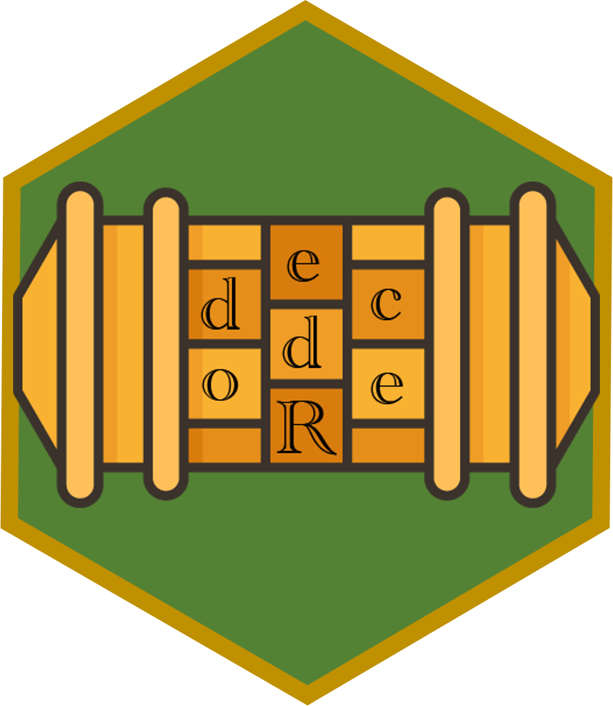

Welcome to the **decodeR** repository! This is a repository for fun activities / assignments for R learners. Each folder in the repository contains: 

- A puzzle focused on the specified skill (or "general" for a variety of general R skills).
  * These puzzles will ask the decoder to complete a series of steps, which will unscramble / translate / decrypt a message or construct an image.
  
- An RMarkdown (or Quarto) file for the puzzle, a solution to the puzzle, and any source code used to create the puzzle, as well as the data files the puzzle depends on.

- A readme file with notes for the instructor.  (*Well, eventually they all will have this...*)

We welcome PRs from anyone, and apologize in advance for any errors in the activities!

